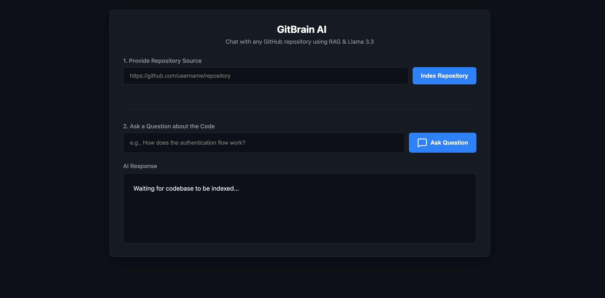
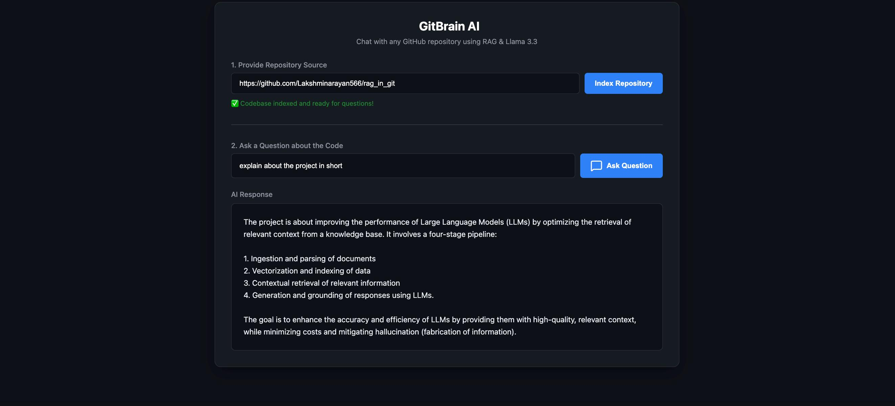
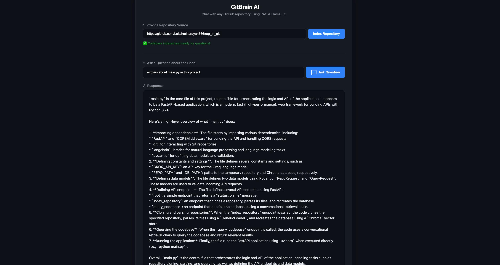

# GitBrain AI – RAG Code Intelligence

GitBrain AI is a Retrieval-Augmented Generation (RAG) system that allows users to index a GitHub repository and ask natural-language questions about its codebase.

## Features

* GitHub repository indexing
* Semantic code search
* Code explanation using RAG
* ChromaDB vector storage
* Groq LLM integration
* FastAPI backend
* Web-based user interface

## How It Works

```text
GitHub Repository
        ↓
Repository Indexing
        ↓
Code Embeddings
        ↓
ChromaDB
        ↓
User Query
        ↓
Relevant Code Retrieval
        ↓
Groq LLM
        ↓
Generated Answer
```

## Screenshots

### User Interface



### RAG Answer 1



### RAG Answer 2



## Project Structure

```text
├── main.py
├── index.html
├── assets/
│   ├── gitbrain-ui.png
│   ├── gitbrain-answer1.png
│   └── gitbrain-answer2.png
└── README.md
```

## Technologies

* **Python**
* **FastAPI**
* **LangChain**
* **Groq / Llama**
* **ChromaDB**
* **HuggingFace Sentence Transformers**
* **Git / GitPython**
* **HTML, CSS, JavaScript**

## Running the Project

### Install Dependencies

```bash
python -m pip install -r requirements.txt
```

### Start the Backend

```bash
python main.py
```

The backend runs locally at:

```text
http://localhost:8000
```

### Usage

1. Open the web interface.
2. Provide a GitHub repository URL.
3. Click **Index Repository**.
4. Enter a question about the repository.
5. Get a RAG-based answer using the indexed codebase.

## Example Queries

```text
Explain the project in short.

Explain main.py in this project.

How does repository indexing work?

Which file handles the API endpoints?

Explain how ChromaDB is used.

How does the RAG pipeline retrieve relevant context?
```

## RAG Pipeline

```text
Repository
    ↓
Clone & Parse
    ↓
Chunk Code
    ↓
Generate Embeddings
    ↓
ChromaDB
    ↓
User Query
    ↓
Semantic Retrieval
    ↓
Relevant Context
    ↓
Groq LLM
    ↓
Grounded Answer
```

## Purpose

The project demonstrates how Retrieval-Augmented Generation can be applied to **repository-level code understanding**, allowing users to interact with a codebase using natural-language queries rather than manually searching through files.

## License

This project is intended for research, experimentation, and educational purposes.
